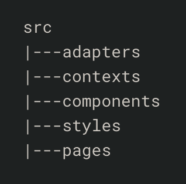
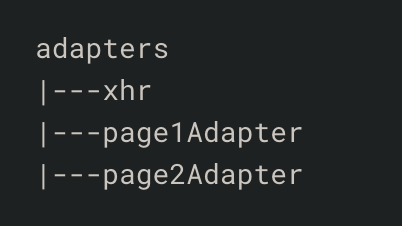
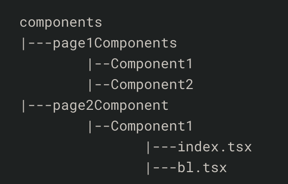
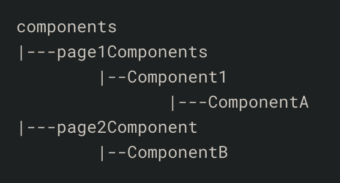
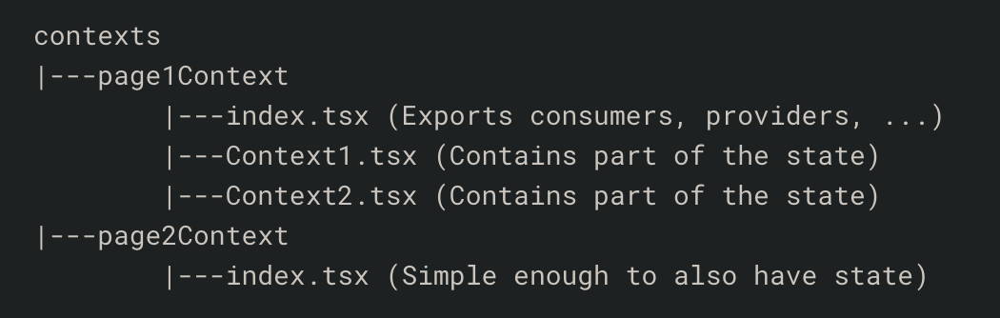

## [A Better Way to Structure React Projects](https://www.freecodecamp.org/news/a-better-way-to-structure-react-projects/)

A complex React project should be structured like below:

> 

**NOTE**

> In the above file structure, the assets or static files should be placed in whatever the variant of `public *` folder for your framework is.\*

### 1. **Adapters**

> `Adapters` are the connectors of your application with the outside world. Any form of API call or websocket interaction which needs to happen, to share data with an external service or client, should happen within the adapter itself.
>
> There are cases where some data is always shared between all the adapters – for example, sharing of cookies, base URL and headers across your AJAX (XHR) adapters. These can be initialized in the xhr folder, and then imported inside of your other adapters to be used further.
>
> 
>
> In the case of axios, use `axios.create` to create a base adapter, and either export this initialized instance, or create different functions for get, post, patch and delete to abstract it further.
>
> ```js script
> // adapters/xhr/index.tsx
>
> import Axios from "axios";
>
> function returnAxiosInstance() {
>   return Axios.create(initializers);
> }
>
> export function get(url) {
>   const axios = returnAxiosInstance();
>   return axios.get(url);
> }
>
> export function post(url, requestData) {
>   const axios = returnAxiosInstance();
>   return axios.post(url, requestData);
> }
> ```
>
> Once the base files are ready, create a separate adapter file for each page, or each set of functionalities, depending on how complex the app is. A well-named function makes it very easy to understand what each API call does and what it should accomplish.
>
> ```js script
> // adapters/page1Adapter/index.tsx
>
> import { get, post } from "adapters/xhr";
> import socket from "socketio";
>
> //  well-named functions
>   return Axios.create(initializers);
> }
>
> export function getData() {
>   return get(someUrl);
> }
>
> export function setData(requestData) {
>   return post(someUrl, requestData);
> }
> ```

### 2. **Components**

> Components will hold
>
> - the UI for the application
> - the Business Logic
> - 0any State which has to be maintained.
>
> In case a component becomes too complex to express Business Logic with your UI, it is good to be able to split it into a separate bl.tsx file, with your root index.tsx importing all of the functions and handlers from it.
> 
> In this structure, each page gets its own folder inside of components, so that it’s easy to figure out which component affects what.
>
> It’s also important to limit the scope of a component. Hence, a component should only use adapters for data-fetching, have a separate file for complex Business Logic, and only focus on the UI part.
>
> ```js script
> // components/page1Components/omponent1/index.tsx
>
> import businessLogic from "./b1.tsx";
>
> export default function Component2() {
>   const{state and functions} = businessLogic();
>   return {
>     //JSX
>   }
> }
> ```
>
> WHile the BL file only imports data and returns it:
>
> ```js script
> // components/page1Components/Component1/bl.tsx
>
> import Ract, { useState, useEffect } from "react";
> import { adapters } from "adapters/path_to_adapter";
>
> export default function Component1Bl() {
>   const [state, setState] = useState(initialState);
>
>   useEffect(() => {
>     fetchDataFromAdapter().then(updateState);
>   });
> }
> ```
>
> However, there’s a problem which is common across all complex apps. **State Management**, and how to share state across distant components. For example, consider the following file structure:
>
> 
>
> If some state has to be shared across ComponentA and B in the above example, it will have to be passed through all the intermediate components, and also to any other components who want to interact with the state.
>
> To solve this, their are several solutions which can be used like Redux, Easy-Peasy, and React Context, each of them having their own pros and cons. Generally, React Context should be “good enough” to solve this problem. We store all of the files related to context in `contexts`.

### 3. Contexts

> The contexts folder is a bare minimum folder only containing the state which has to be shared across these components. Each page can have several nested contexts, with each context only passing the data forward in a downward direction. But to avoid complexity, it is best to only have a single context file. This structure will look like this:
>
> 
>
> In the above case, since page1 may be a bit more complex, we allow some nested context by passing the child context as a child to the parent. However, generally a single index.tsx file containing state and exporting relevant files should be enough.
>
> The context is allowed to import from adapters to fetch and react to external effects. In case of React Context, the providers are imported inside pages to share state across all components, and something like ` useContext`` is used inside these components ` to be able to utilize this data.

### 4. Pages

> This is a specific folder for route-level components
>
> This helps you move through the code quickly and with clarity of what belongs where. It also sets a clear hierarchy of differentiation between `pages` and `components`, where a page can import a component to display it and do nothing else, not even Business Logic.
>
> However, it’s possible to import Context Providers inside of your page so the child components can consume it

### 5. Styles

> Store all of CSS files inside of the `styles` folder, and import or link to them frelly from wherever you wish
